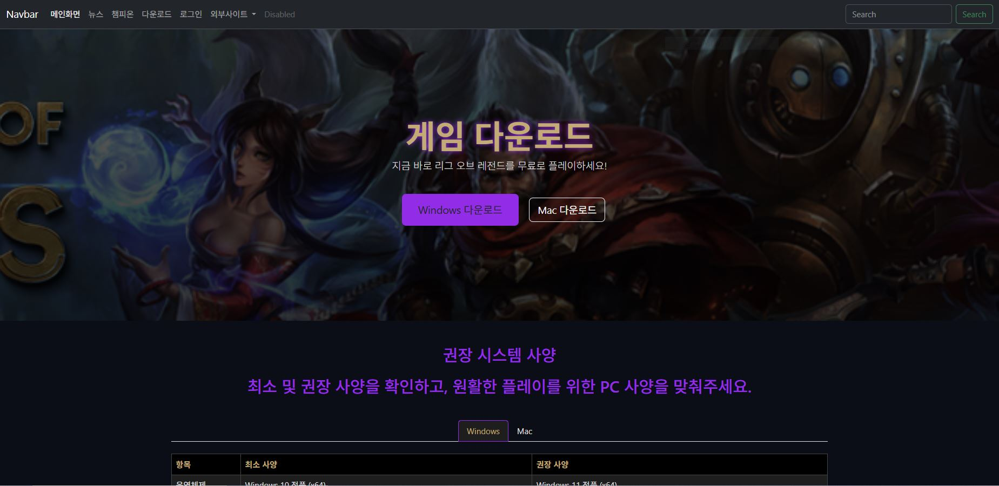
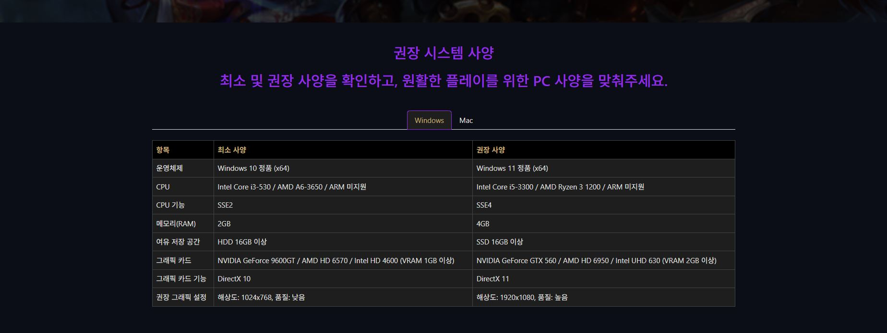
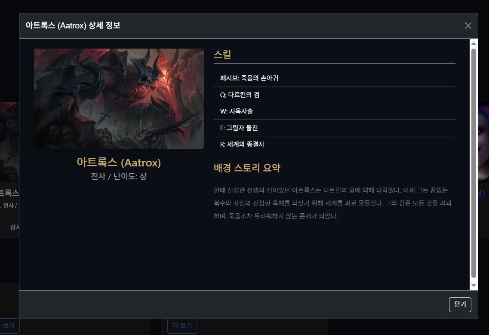
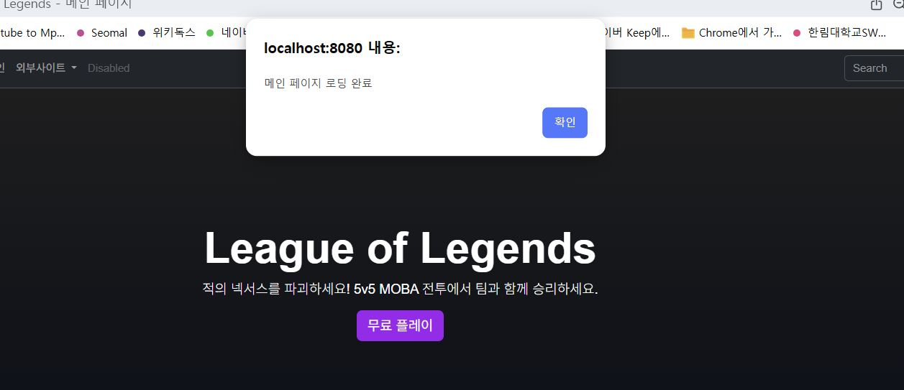
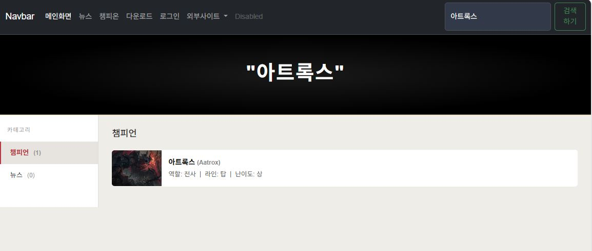

# code-with-quarkus

This project uses Quarkus, the Supersonic Subatomic Java Framework.

If you want to learn more about Quarkus, please visit its website: <https://quarkus.io/>.

## Running the application in dev mode

You can run your application in dev mode that enables live coding using:

```shell script
./mvnw quarkus:dev
```

> **_NOTE:_**  Quarkus now ships with a Dev UI, which is available in dev mode only at <http://localhost:8080/q/dev/>.

## Packaging and running the application

The application can be packaged using:

```shell script
./mvnw package
```

# quarkus 프로젝트 시작! (학번 : 20231411 이름 : 조희진 )
<br>매 주 수업 내용을 정리하자.

## 2, 3주차 수업 내용
<br>실습 1 : 쿼크스 환경 구축 및 준비 완료!
<br>실습 2 : HTML 기본 및 LOL 메인 화면 개발 완료!
<div align="center">


</div>
<br>

## 4주차 수업 내용
<br>부트스트랩 abbbar 사용
<br>상세페이지 버튼 제작

## 5주차 수업 내용
<br>모달창 구현하기 
<br>서브페이지 구현하기
<br>다운로드 페이지 html, css 구현하기
<br>css파일 추가하기 

<div align="center">



</div>

## 6주차 수업 내용
<br>스크립트 로컬 연동
<br>검색 구현하기

<div align="center">

</div>

## 7주차 수업 내용
<br>실시간 챔피언 검색하기
<br>search.js 자바스크립트 수정하기
<br>데이터 타입 및 변수 정의
<br>카테고리(챔피온, 뉴스) 별 컨텐츠를 출력

<div align="center">

</div>


