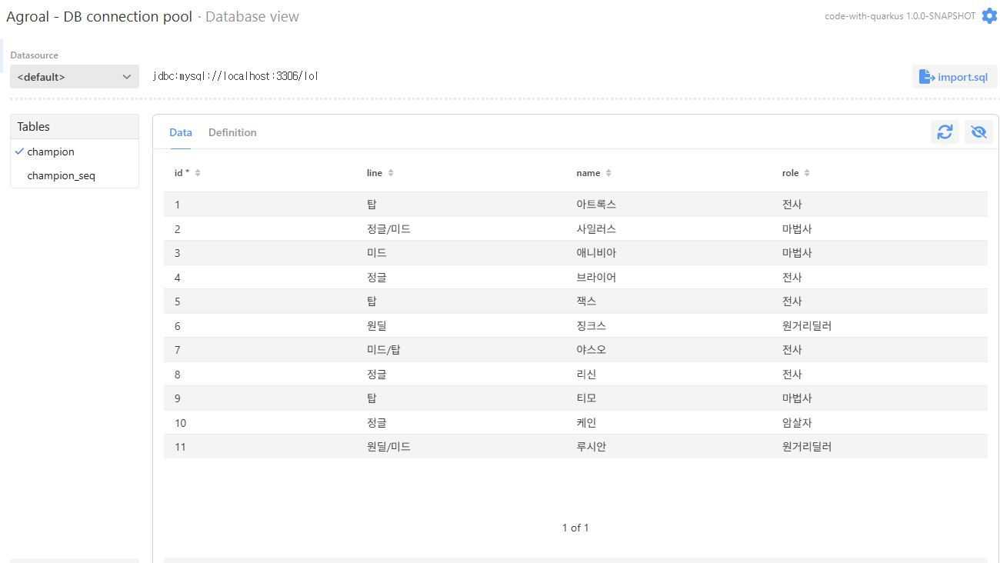
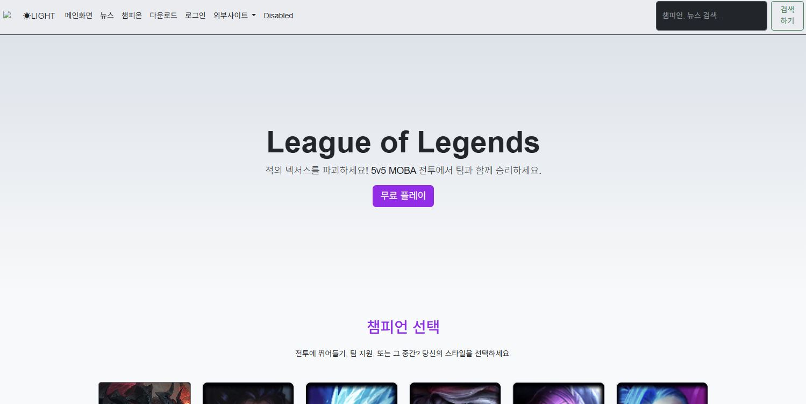
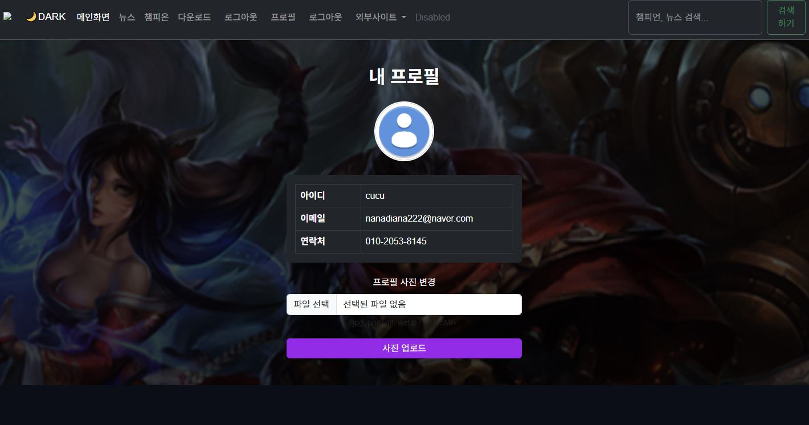
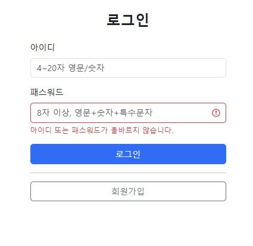
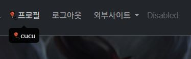
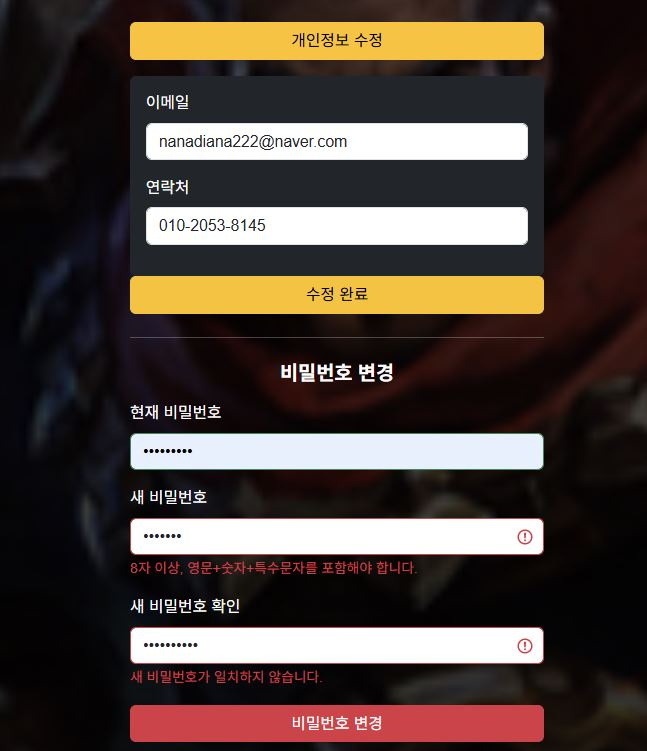

# code-with-quarkus

This project uses Quarkus, the Supersonic Subatomic Java Framework.

If you want to learn more about Quarkus, please visit its website: <https://quarkus.io/>.

## Running the application in dev mode

You can run your application in dev mode that enables live coding using:

```shell script
./mvnw quarkus:dev
```

> **_NOTE:_**  Quarkus now ships with a Dev UI, which is available in dev mode only at <http://localhost:8080/q/dev/>.

## Packaging and running the application

The application can be packaged using:

```shell script
./mvnw package
```

# quarkus 프로젝트 시작! (학번 : 20231411 이름 : 조희진 )
<br>매 주 수업 내용을 정리하자.

## 2, 3주차 수업 내용
<br>실습 1 : 쿼크스 환경 구축 및 준비 완료!
<br>실습 2 : HTML 기본 및 LOL 메인 화면 개발 완료!
<div align="center">


</div>
<br>

## 4주차 수업 내용
<br>부트스트랩 abbbar 사용
<br>상세페이지 버튼 제작

## 5주차 수업 내용
<br>모달창 구현하기 
<br>서브페이지 구현하기
<br>다운로드 페이지 html, css 구현하기
<br>css파일 추가하기 

<div align="center">


</div>

## 6주차 수업 내용
<br>스크립트 로컬 연동
<br>검색 구현하기

<div align="center">

</div>

## 7주차 수업 내용
<br>실시간 챔피언 검색하기
<br>search.js 자바스크립트 수정하기
<br>데이터 타입 및 변수 정의
<br>카테고리(챔피온, 뉴스) 별 컨텐츠를 출력

<div align="center">

</div>

## 9주차 수업 내용
<br>다크모드, 화이트모드 구현
<br>mysql 연결
<br>데이터베이스 연동
<br>테이블 정의 추가하기
<br>테이블 데이터 삽입하기


<div align="center">


</div>

## 10주차 수업 내용
<br>메인화면 로그인 버튼 연결
<br>Quarkus /login 엔드포인트, 로그인 페이지 작성, Quarkus /login_check 엔드포인트, 로그인 후 페이지 (로그아웃 버튼)
<br>사용자 테이블 생성(User.java를 작성), 임시 사용자 데이터 삽입(DataSeeder.java에 추가)
<br>세션 활성화 설정 추가(SessionConfig.java 파일을 작성)
<br>DB 사용자 체크 (login_check 완성) / AuthResource.java를 수정


## 11주차 수업 내용
<br>회원가입 버튼 추가,  register 엔드포인트 등록(AuthResource.java를 수정)
<br>회원가입 화면 작성하기(ogin 폴더의 register.html을 수정)
<br>회원 테이블 수정하기
<br>입력 값 유효성 검사(JS)
<br>SHA-256 해시, 모달창
<br>/register_check 엔드포인트
<br>/register_success 엔드포인트

## 12주차 수업 내용
<br>로그인 페이지 암호화 구현
<br>guest 계정 패스워드 - 해시값으로 교체
<br>메인화면 - 세션 체크
<br>네비바에 프로필 링크 추가
<br>/profile - 엔드포인트 등록
<br>프로필 사진 컬럼 추가
<br>프로필 페이지 화면 작성
<br>/profile/info – 엔드포인트
<br>/profile/upload – 엔드포인트
<br>로그인 에러 처리
<div align="center">


</div>

## 13주차 수업 내용
<br>네비바의 사용자명 동적 표시
<br>회원정보 수정 폼 추가 - 기존 값 자동 채움, 정규식 검사
<br>회원정보 수정 - 엔드포인트, 결과 및 메시지
<br>비밀번호 변경 폼 추가
<br>비밀번호 유효성 검사 + 해시
<br> 비밀번호 변경 – 엔드포인트(로그 아웃)
<br>비밀번호 변경 – 성공 Toast 처리
<div align="center">


</div>


